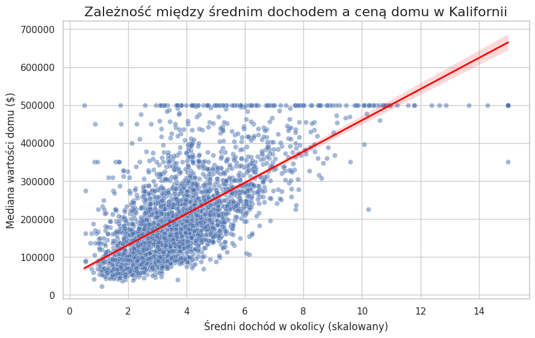

# Analiza cen nieruchomości w Kalifornii

## 🎯 Cel projektu
Celem projektu było zbadanie korelacji między średnimi dochodami mieszkańców a wartością rynkową nieruchomości w Kalifornii oraz budowa modelu predykcyjnego.

## 📊 Kluczowe wnioski
- Zidentyfikowano silną korelację dodatnią (0.67) między dochodem a ceną domu.
- Wizualizacja wykazała tzw. "efekt sufitu" przy wartościach powyżej 500k$, co stanowi ograniczenie zbioru danych.
- Model regresji liniowej osiągnął wynik R-squared 0.50, co potwierdza wysoką trafność wybranej zmiennej niezależnej.

## 🛠 Technologie
- Python (Pandas, Seaborn, Matplotlib, Scikit-Learn)
- Google Colab

## 📈 Wizualizacja

